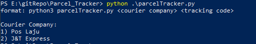
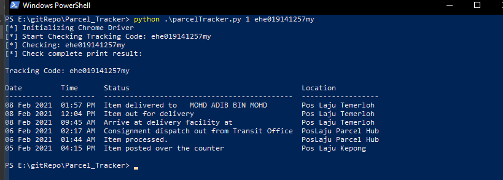
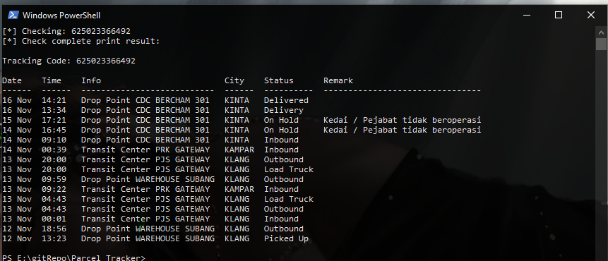

# Malaysia Parcel Tracker in CLI

 ## [!] This Is The First Version. Will Add More Courier Parcel Tracking In The Future.
 Install Dependencies
 ```
 pip3 install -r requirements.txt
 ```
 Tested on:
 ```
 OS: Windows 10 x64
 Chrome version: 89.0.4389.114
 ```
 ### Chrome driver must match your current Chrome version
 The Chrome driver can be download from 
 ```
 https://chromedriver.chromium.org/downloads
 ```

 Help Menu:
 ```
format: python3 parcelTracker.py <courier company> <tracking code>
```
Current supported Courier Company
```
1) Pos Laju
2) J&T Express
```
 Usage:

### Help Menu
 


### Poslaju
 


### J&T Express
 