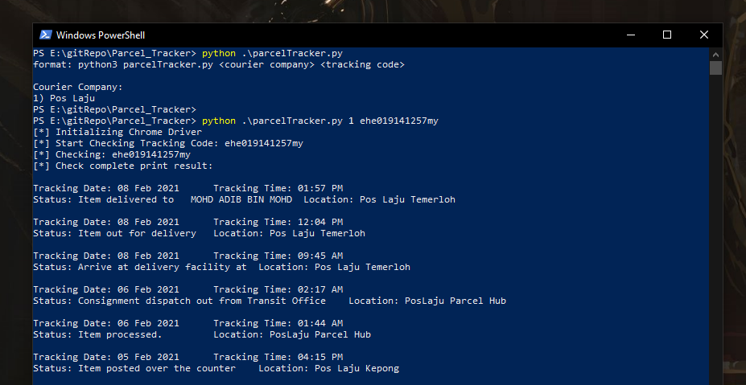

# Parcel_Tracker
Malaysia Parcel Tracker CLI 
 
 Malaysia Parcel Tracker in CLI
 
 Install Dependencies
 ```
 pip3 install -r requirements.txt
 ```
 
 Help Menu:
 ```
format: python3 parcelTracker.py <courier company> <tracking code>
```
Current supported Courier Company
```
1) Pos Laju
```
 Usage:
 
 